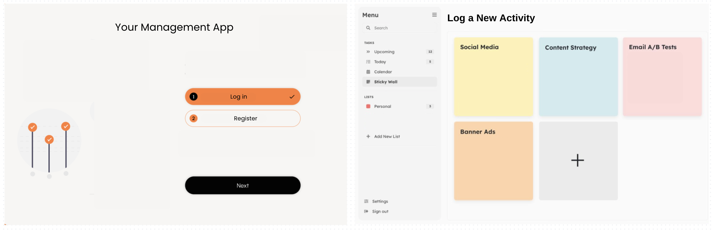

# Agenda Hub Project

## Project Mock-up

## Idea Description
A web application that allows users to log their daily activities, providing a platform to track time spent on various tasks and reflect on productivity. Users can analyze their time usage to identify patterns, set personal improvement goals, and visualize trends over time. By offering insights into daily time allocation, this self-reflective tool can enhance personal productivity and help users prioritize tasks effectively.

## Data Model
-ERD/Data Entity Fields:

## User Stories

- User Registration and Login
As a user, I want to create an account so I can securely log my activities.
As a user, I want to log in to my account so I can access my activities.

- Logging Activities
As a user, I want to log a new activity with its name, duration, and date so I can track my time effectively.
As a user, I want to edit or delete activities I have logged for better accuracy.

- Viewing and Analyzing Activities
As a user, I want to view a list of all my activities to understand how I’m spending my time.
As a user, I want to see a summary of time spent on different activities to identify trends.

- Setting Goals
As a user, I want to set goals for my activities so that I can improve my time management.

- Visualizing Data
As a user, I want to see visual representations (charts) of my activity data to better understand my time usage.

## Pseudo Code
// User Registration
function registerUser(name, email, password):
    hashedPassword = hash(password)  // Secure password storage
    userId = saveToDatabase(User, {name, email, hashedPassword})
    return userId

// User Login
function loginUser(email, password):
    user = findUserByEmail(email)
    if user and verifyHash(password, user.password):
        return user.id  // Successful login
    else:
        return "Invalid credentials"

// Log Activity
function logActivity(userId, activityName, duration, date):
    activityId = saveToDatabase(Activity, {name: activityName, duration, date, userId})
    return activityId

// View Activities
function getUserActivities(userId):
    return fetchFromDatabase(Activity where userId = userId)

// Edit Activity
function editActivity(activityId, newName, newDuration, newDate):
    updateDatabase(Activity, activityId, {name: newName, duration: newDuration, date: newDate})

// Delete Activity
function deleteActivity(activityId):
    removeFromDatabase(Activity, activityId)

// Set Goals
function setGoal(userId, goal):
    saveToDatabase(Goal, {userId, goal})

// Visualize Trends
function visualizeTimeUsage(userId):
    activities = getUserActivities(userId)
    generateCharts(activities)  // Create charts based on activity data

## Prerequisites
- [Node.js](https://nodejs.org/) 
- [MongoDB](https://www.mongodb.com/) 
- [Git](https://git-scm.com/) 

## Features
- User Authentication: Email/social media sign-up and profile management.
- Dashboard Overview: Central view of upcoming events, tasks, and calendar.
- Event Creation: Input event details, select privacy settings, and choose themes.
- Task Management: Create and manage to-do lists with deadlines.
- Carbon Footprint Tracking: Track emissions and set reduction goals.

Happy Coding!
