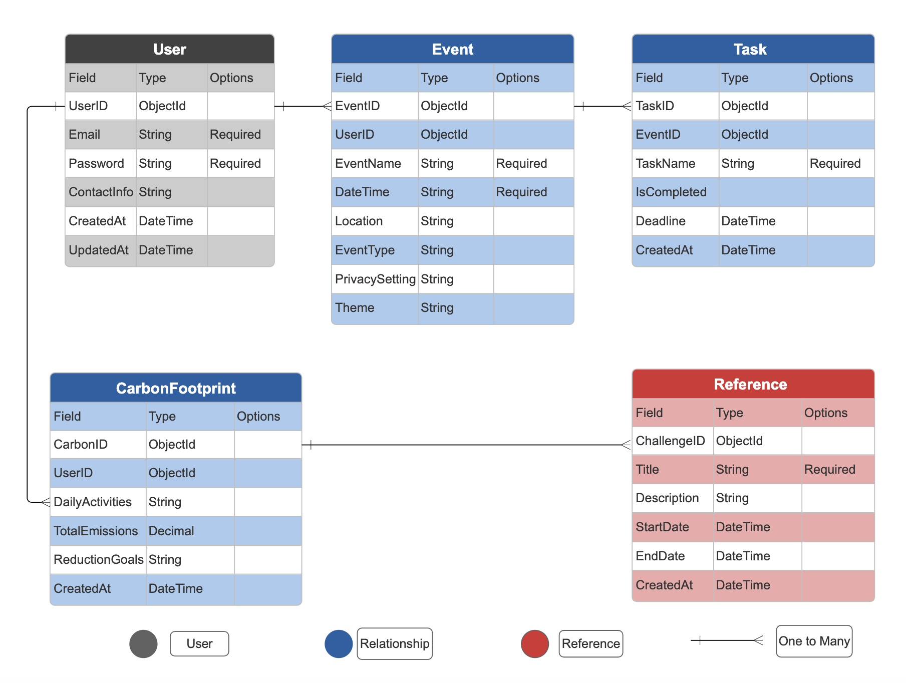

# Agenda Hub Project

## Project Mock-up

## Idea Description
The Agenda Hub is a comprehensive application designed to help users efficiently plan and manage various events, from personal parties to corporate meetings. It allows users to create events, invite friends, track RSVPs, and manage budgets within an intuitive interface. Additionally, it promotes sustainability through carbon footprint tracking features, offering users tools to measure and reduce their environmental impact while organizing events.

## Data Model
-ERD/Data Entity Fields:

## User Stories
User Authentication:
- As a user, I want to sign up using my email or social media for easy access.
- As a user, I want to manage my profile to keep my contact information updated.

Dashboard:
-	As a user, I want to view a summary of my upcoming events and carbon footprint on my dashboard.
-	As a user, I want to switch to a calendar view to see my events by date.

Event Creation:
- As a user, I want to create an event with details like name, date, and location.
- As a user, I want to set privacy settings for my event.

Invitations and RSVPs:
- As a user, I want to invite friends and track their RSVPs.
- As a user, I want to manage my guest list and see dietary restrictions.

Carbon Footprint Tracking:
- As a user, I want to input my daily activities to calculate my carbon emissions.
- As a user, I want suggestions to reduce my carbon footprint and track my progress.

Community Challenges:
- As a user, I want to join community challenges to collectively reduce carbon footprints.
- As a user, I want to see my progress compared to others in the community.

## Pseudo Code

## Prerequisites
- [Node.js](https://nodejs.org/) 
- [MongoDB](https://www.mongodb.com/) 
- [Git](https://git-scm.com/) 

## Features
- User Authentication: Email/social media sign-up and profile management.
- Dashboard Overview: Central view of upcoming events, tasks, and calendar.
- Event Creation: Input event details, select privacy settings, and choose themes.
- Task Management: Create and manage to-do lists with deadlines.
- Carbon Footprint Tracking: Track emissions and set reduction goals.

Happy Coding!
